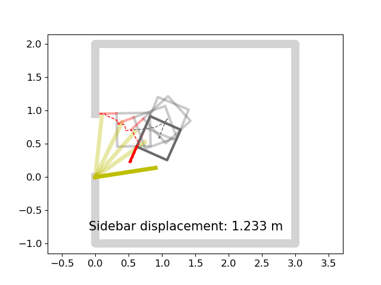
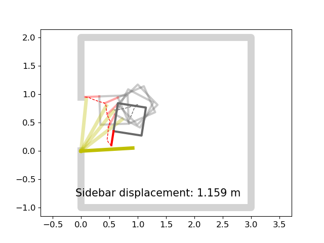
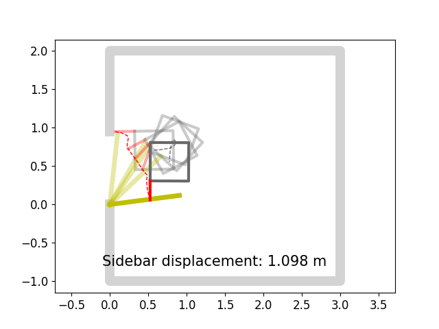
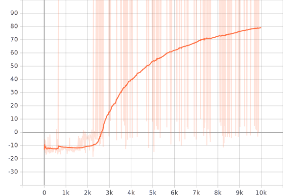
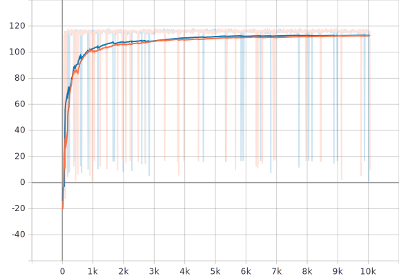
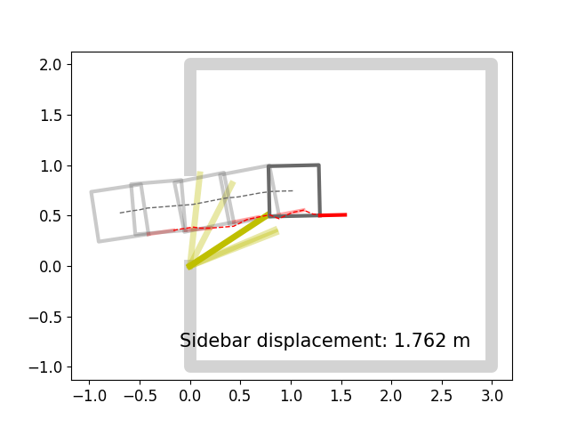
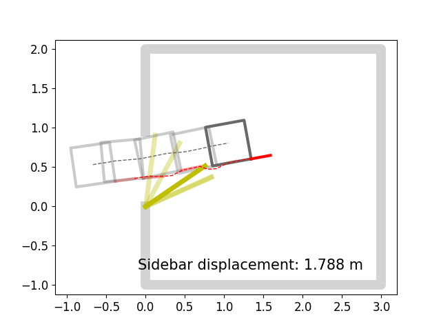

# Trained Model Test for validate robustness, generalization

# Training Physical Environment
## door property
- dimension (width x depth x height) : 0.9144 x 0.04445 x 2.032 meters
- mass: 41.3256 kg
- hinge:
  - spring stiffness: 1
  - spring reference: 1
  - damping: 0.1
  - friction: 0.1
- initial open angle: 0.1 radian    
## mobile base
- dimension (length x width x height): 50 x 50 x 17.5 centimeters
- hook length: 0.25 centimeters
- mass: 34 kg   
- wheel-ground contact friction coefficients:
  - mu1: 0.1
  - mu2: 0.1
- mobile control:
  - type: skid steer drive
  - torque: 30
## scene color
- door color: Gazebo/Yellow
- Wall color: Gazebo/White

# Test (100 random test cases)
### door pulling task
- training performance

- policy test
  - the cost is roughly estimated by the total displacement of the end of the side bar required to complete the task

|models |success rate |average steps |minimum steps |maximum steps |average cost |lowest cost | highest cost |average value |lowest value |highest value|
|:---:|:---:|:---:|:---:|:---:|:---:|:---:|:---:|:---:|:---:|:---:|
|dqn without noise | 92% | 26 | 18 | 56 | 1.775 m | 1.233 m | 3.667 m | 100.423 | 46.279 | 118.414 |
|ppo without noise | 100% | 15 | 14 | 19 | 1.265 m | 1.159 m | 1.356 m | 98.492 | 84.670 | 104.381 |
|ppo with noise    | 94% | 18 | 16 | 29 | 1.253 m | 1.108 m | 1.480 m | 4.923 | 4.923 | 4.923 |

- shortest trajectories

| dqn without noise | ppo without noise | ppo with noise |
|:---:|:---:|:---:|
| |  |  |

### door traversing task
- training performance

- policy test

|models |success rate |average steps |minimum steps |maximum steps |average cost |lowest cost | highest cost | average value |lowest value |highest value|
|:---:|:---:|:---:|:---:|:---:|:---:|:---:|:---:|:---:|:---:|:---:|
|dqn without noise | 74% | 26 | 17 | 48 | 1.997 m | 1.378 m | 3.241 m | 95.922 | 68.331 | 115.080 |
|ppo without noise | 95% | 23 | 14 | 42 | 1.941 m | 1.263 m | 3.297 m | 91.282 | -3.375 | 135.198 |
|ppo with noise    | 87% | 23 | 17 | 47 | 1.953 m | 1.525 m | 2.906 m | 92.125 | 42.564 | 105.229 |

- shortest trajectories

| dqn without noise | ppo without noise | ppo with noise |
|:---:|:---:|:---:|
| |  |  |

### door pushing task
- training performance

- policy test

|models |success rate |average steps |minimum steps |maximum steps |average cost |lowest cost | highest cost |average value |lowest value |highest value|
|:---:|:---:|:---:|:---:|:---:|:---:|:---:|:---:|:---:|:---:|:---:|
|dqn without noise | 99% | 18 | 16 | 20 | 1.905 m | 1.732 m| 2.064 m | 75.001 | 75.001 | 75.001|
|ppo without noise | 98% | 17 | 16 | 19 | 1.953 m | 1.781 m | 2.295 m | 98.263 | 93.044 | 102.513 |
|ppo with noise    | 98% | 17 | 17 | 21 | 1.937 m | 1.840 m | 2.076 m | 98.516 | 93.192 | 106.429 |

- shortest trajectories

|dqn without noise |ppo without noise |ppo with noise |
|:---:|:---:|:---:|
|  |  |  |
