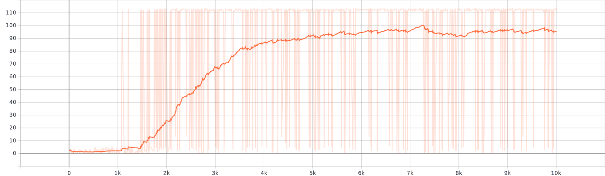

# trained models

## model 0 (baseline)
- name: door_open_0
- learning curve:
- parameters:
  - dqn cnn:
    - input: 64x64x3
    - Conv2D: 32x3
    - MaxPool2D: 2x2
    - Conv2D: 32x3
    - MaxPool2D: 2x2
    - Conv2D: 23x3
    - Flatten
    - Dense: 128
    - output: 8
  - observation: rgb image 64x64x3
  - action dimension (linear vel x, angular vel z): [[3.0,6.28], [3.0,0.0], [0.0,6.28],[-3.0,6.28],[-3.0,0.0],[3,-6.28],[0.0,-6.28],[-3,-6.28]]
  - door is open when angle of door is over 0.45*pi
  - step reward: open*100+!open*10*delta_angle
  - initial door angle: 0.1
  - max episode steps: 100
  - door dimension (width x depth): 0.9144 meters x 0.0698 meters
  - number of training episode: 10000
  - train frequency: 80 (steps)
  - warm up episodes: 200
  - init epsilon: 1.0
  - terminal epsilon: 0.1
  - learning rate: 0.001
  - discount rate: 0.99
  - loss function: mean squared error (MSE)
  - batch size: 64
  - buffer size: 10000  

## model 1 (reduced action space)
- name: door_open_1
- learning curve:
- parameters:
  - dqn cnn:
    - input: 64x64x3
    - Conv2D: 32x3
    - MaxPool2D: 2x2
    - Conv2D: 32x3
    - MaxPool2D: 2x2
    - Conv2D: 23x3
    - Flatten
    - Dense: 128
    - **output: 5**
  - observation: rgb image 64x64x3
  - **action dimension (linear vel x, angular vel z): [[3.0,6.28], [3.0,0.0], [0.0,6.28],[-3.0,6.28],[-3.0,0.0]]**
  - door is open when angle of door is over 0.45*pi
  - step reward: open*100+!open*10*delta_angle
  - initial door angle: 0.1
  - max episode steps: 100
  - door dimension (width x depth): 0.9144 meters x 0.0698 meters
  - number of training episode: 10000
  - train frequency: 80 (steps)
  - warm up episodes: 200
  - init epsilon: 1.0
  - terminal epsilon: 0.1
  - learning rate: 0.001
  - discount rate: 0.99
  - loss function: mean squared error (MSE)
  - batch size: 64
  - buffer size: 10000   

## model 2 (reward with penaulty)
- name: door_open_2
- learning curve:
- parameters:
  - dqn cnn:
    - input: 64x64x3
    - Conv2D: 32x3
    - MaxPool2D: 2x2
    - Conv2D: 32x3
    - MaxPool2D: 2x2
    - Conv2D: 23x3
    - Flatten
    - Dense: 128
    - output: 5
  - observation: rgb image 64x64x3
  - action dimension (linear vel x, angular vel z): [[3.0,6.28], [3.0,0.0], [0.0,6.28],[-3.0,6.28],[-3.0,0.0]]
  - door is open when angle of door is over 0.45*pi
  - ** step reward: open*100+!open*10*delta_angle - 0.1 **
  - initial door angle: 0.1
  - max episode steps: 100
  - door dimension (width x depth): 0.9144 meters x 0.0698 meters
  - number of training episode: 10000
  - train frequency: 80 (steps)
  - warm up episodes: 200
  - init epsilon: 1.0
  - terminal epsilon: 0.1
  - learning rate: 0.001
  - discount rate: 0.99
  - loss function: mean squared error (MSE)
  - batch size: 64
  - buffer size: 10000   
